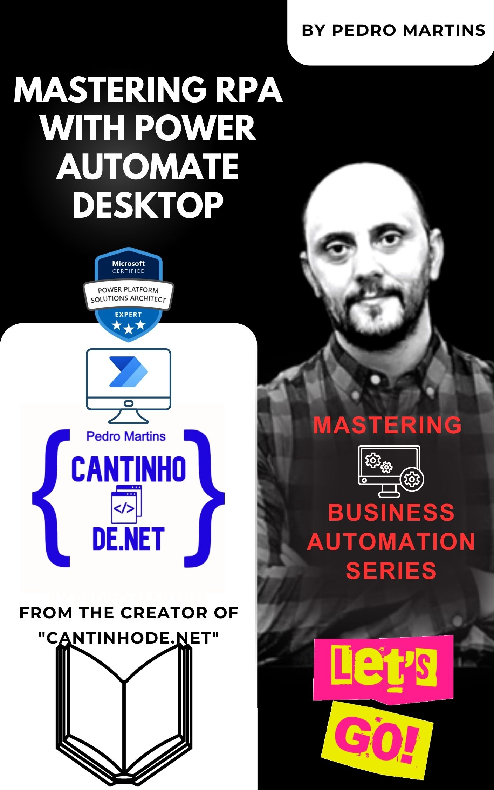

# Mastering RPA with Power Automate Desktop: Mastering Business Automation Series
**Cantinhode.net**
 
## Pedro Martins

_****_

## _**Pedro Martins**_ 

## _**Software/Solution Architect**_

The author possesses vast experience in analysing, designing, implementing, and managing systems. They have actively participated in numerous projects across various industries, including healthcare consulting, construction solutions, financial institutions, banking, ticketing, interactive television, competitiveness analysis, and business analysis. To support the growth of the coding community and share their expertise, they have created a website (https://cantinhode.net). This website includes opinion articles, practical examples, and their resume, with the aim of fostering the development of technical solutions for information systems architecture across different domains, programming languages, and on-premises as well as cloud environments.
